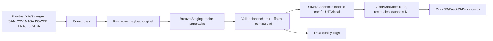

# Diseño técnico del MVP de interoperabilidad de datos energéticos

> Fecha de diseño: 2026-07-06. Este documento evita inventar endpoints concretos; cualquier endpoint de XM/Sinergox/SIMEM, CAISO o PJM debe validarse contra documentación oficial antes de producción. Fuentes oficiales consultadas: repositorio `EquipoAnaliticaXM/API_XM`, sitio Sinergox, documentación NASA POWER, CAISO OASIS y PJM Data Miner 2.

## 1. Diagnóstico técnico

El problema no es ausencia de modelos predictivos sino ausencia de contratos semánticos. Un dashboard puede graficar series, pero no garantiza que `kW`, `kWh`, timestamps locales, intervalos de medición, nombres de inversores, medidores fiscales, pérdidas por curtailment y señales de mercado sean comparables. Un modelo predictivo entrenado sobre datos sin linaje reproducirá errores de zona horaria, agregación y calidad de sensores.

El MVP debe convertir fuentes heterogéneas en entidades canónicas auditables: mediciones operativas, observaciones meteorológicas, señales de mercado, eventos de disponibilidad y KPIs.

## 2. Arquitectura propuesta



Recomendación: ELT híbrido. Se extrae y preserva raw inmutable; se transforma a bronze/silver/gold con jobs reproducibles. Para MVP local: Parquet + DuckDB. Para escala: object storage + Iceberg/Delta, TimescaleDB para series consultivas, ClickHouse para analítica masiva.

| Capa | Contenido | Formato | Regla |
|---|---|---|---|
| raw | JSON/XML/CSV/XLSX original | bytes + metadata | inmutable, particionado por fuente/fecha |
| bronze | payload parseado casi 1:1 | Parquet | nombres fuente, tipos básicos |
| silver | entidades canónicas | Parquet/DuckDB | UTC/local, unidades SI, IDs maestros |
| gold | KPIs y features | Parquet/SQL | datasets listos para ML/API |

Errores: reintentos exponenciales, backoff por `429`, circuit breaker por fuente, bitácora `ingestion_run`, checksum del payload, y quarantine para archivos inválidos.

## 3. Modelo canónico de datos

Convenciones: snake_case, IDs estables tipo `plant_id`, timestamps `timestamp_utc` y `timestamp_local`, unidades explícitas, claves foráneas obligatorias en silver/gold.

| Entidad | PK | FKs | Campos clave |
|---|---|---|---|
| `asset` | `asset_id` | `plant_id` | `asset_type`, `name`, `timezone`, `metadata_json` |
| `plant` | `plant_id` | - | `country`, `technology`, `latitude`, `longitude`, `capacity_mw_ac`, `capacity_mw_dc` |
| `inverter`/`turbine`/`meter`/`sensor` | component_id | `asset_id` | `manufacturer`, `model`, `rated_power_kw`, `commissioning_date` |
| `weather_observation` | observation_id | `asset_id`, `sensor_id` | `timestamp_utc`, `ghi_w_m2`, `dni_w_m2`, `wind_speed_m_s`, `temperature_c` |
| `market_signal` | signal_id | optional `market_node_id` | `market`, `timestamp_utc`, `price`, `currency`, `unit`, `source` |
| `operational_measurement` | measurement_id | `asset_id`, optional `sensor_id` | `variable`, `value`, `unit`, `quality_flag` |
| `expected_power` | expected_power_id | `asset_id` | `model_name`, `power_kw_expected`, `model_version` |
| `energy_interval` | interval_id | `asset_id`, `meter_id` | `interval_start_utc`, `interval_end_utc`, `energy_kwh_net`, `energy_kwh_gross` |
| `availability_event` | event_id | `asset_id` | `start_utc`, `end_utc`, `event_type`, `forced`, `source` |
| `curtailment_event` | event_id | `asset_id` | `start_utc`, `end_utc`, `curtailed_energy_kwh`, `reason` |
| `data_quality_flag` | flag_id | `entity_id` | `rule_id`, `severity`, `message`, `source_row_hash` |
| `loss_category` | loss_category_id | - | `code`, `name`, `controllable`, `hierarchy_path` |
| `kpi_result` | kpi_result_id | `asset_id` | `kpi_name`, `period_start_utc`, `period_end_utc`, `value`, `unit` |

## 4. Normalización temporal

1. Resolver timezone del activo desde `plant.timezone`; Colombia usa `America/Bogota` y no DST actual, pero el motor debe soportar DST para CAISO/PJM.
2. Parsear timestamp fuente como timezone-aware si trae offset; si no, localize con timezone declarada.
3. Guardar siempre `timestamp_utc` y `timestamp_local`.
4. Resamplear potencia promedio con media ponderada por duración; energía integrada con suma; precios con promedio horario o liquidación definida por mercado.
5. Usar intervalos semiabiertos `[start, end)` para evitar doble conteo.

## 5. Validación de calidad

Reglas mínimas:

```python
# Ejecutable en espíritu; ajustar imports al proyecto.
assert frame["timestamp_utc"].is_monotonic_increasing
assert not frame.duplicated(["asset_id", "timestamp_utc", "variable"]).any()
assert frame.query("variable == 'ghi' and value < 0").empty
assert frame.query("variable == 'power_ac_kw' and value > rated_power_kw * 1.10").empty
frozen = frame.groupby("sensor_id")["value"].rolling(12).std().eq(0)
```

Se deben registrar flags: `schema_error`, `missing_interval`, `duplicate_timestamp`, `frozen_sensor`, `physical_range_violation`, `night_irradiance`, `outlier_iqr`, `lineage_missing`.

## 6. KPIs operativos

| KPI | Fórmula base |
|---|---|
| Energía bruta | suma de energía antes de pérdidas controlables |
| Energía neta | lectura de medidor fiscal o suma validada de medidores netos |
| Disponibilidad | `1 - horas_indisponibles / horas_periodo` ponderada por potencia |
| Curtailment | `max(0, expected_power_kw - actual_power_kw)` integrado en kWh cuando hay señal/evento de restricción |
| PR | `energy_ac_kwh / (poa_irradiance_kwh_m2 * capacity_kw_dc / 1000)` |
| Potencia esperada PV | pvlib: irradiancia + temperatura + modelo sistema; fallback MVP: `ghi/1000 * capacity_kw_ac` |
| Residual | `actual_power_kw - expected_power_kw` |
| Métrica económica | `energy_kwh * price_currency_per_mwh / 1000` |

Degradación: usar RdTools para normalización meteorológica y tendencia; eólico: usar OpenOA para QA, pérdidas y curvas de potencia.

## 7. Diseño del repositorio

```text
energy-interoperability-mvp/
  README.md
  pyproject.toml
  docker-compose.yml
  .env.example
  src/energy_interop/
    config/          # settings con pydantic-settings
    connectors/      # adaptadores de fuentes
    canonical/       # modelos Pydantic y contratos
    validation/      # Pandera/Great Expectations
    transformations/ # tiempo, unidades, resampling
    analytics/       # KPIs, expected power, residuales
    api/             # FastAPI
    orchestration/   # Prefect flows
    storage/         # Parquet, DuckDB, SQL repositories
    utils/           # logging, hashing, retries
  tests/             # unitarias e integración
  examples/          # pipelines ejecutables
  docs/              # arquitectura y ADRs
  dbt/               # modelos SQL si se adopta warehouse
```

## 8. Interfaces de conectores

La interfaz ejecutable está en `src/energy_interop/connectors/base.py`. Conectores iniciales: `SamCsvConnector` y `XmSinergoxConnector`. El conector XM es conceptual y exige configurar URL/dataset según documentación oficial validada.

## 9. Ejemplo de pipeline

El script `examples/run_sam_pipeline.py` carga un CSV SAM simplificado, normaliza tiempo, valida, calcula potencia esperada simple y escribe Parquet.

## 10. API interna

Endpoints sugeridos:

| Endpoint | Uso | Parámetros |
|---|---|---|
| `GET /assets` | catálogo de activos | `limit`, `offset`, `technology` |
| `GET /assets/{asset_id}/operational-measurements` | series operativas | `start`, `end`, `variable`, `granularity` |
| `GET /assets/{asset_id}/weather` | clima | `start`, `end`, `source` |
| `GET /assets/{asset_id}/kpis` | KPIs | `start`, `end`, `kpi_name` |
| `GET /assets/{asset_id}/quality-flags` | calidad | `severity`, `rule_id` |
| `GET /assets/{asset_id}/residuals` | real vs esperado | `model_version` |
| `GET /assets/{asset_id}/events` | disponibilidad/curtailment | `event_type` |

Ejemplo JSON:

```json
{"items":[{"asset_id":"pv_demo","timestamp_utc":"2026-01-01T17:00:00Z","variable":"power_ac_kw","value":850.2,"unit":"kW"}],"limit":1000,"next_offset":1000}
```

## 11. Base de datos y almacenamiento

MVP: Parquet particionado `zone/source=.../asset_id=.../year=YYYY/month=MM/` + DuckDB para SQL local. PostgreSQL almacena catálogo y ejecución de pipelines; no es ideal como data lake. TimescaleDB cuando la API requiera consultas temporales concurrentes. ClickHouse cuando haya años de SCADA subhorario multi-país. dbt aplica para transformaciones SQL gold reproducibles sobre DuckDB/Postgres/ClickHouse.

## 12. Roadmap

| Fase | Alcance | Entregables | Riesgos | Criterio de éxito |
|---|---|---|---|---|
| 0 | archivos locales | SAM CSV, manual SCADA, Parquet | formatos variables | pipeline corre local y tests pasan |
| 1 | Colombia | XM/Sinergox conceptual validado + mercado | cambios API/rate limits | ingesta histórica reproducible |
| 2 | clima externo | NASA POWER, NSRDB/ERA5 | licencias/volumen | clima alineado con activos |
| 3 | KPIs/QA | disponibilidad, PR, curtailment | semántica de pérdidas | KPIs auditables |
| 4 | API/dashboard | FastAPI + dashboard | performance | consultas <2s para periodos típicos |
| 5 | multi-país | CAISO/PJM/OPSD/PVDAQ | normalización de mercados | nuevos conectores sin romper modelo |

## 13. Seguridad, gobernanza y trazabilidad

Credenciales por variables de entorno o secrets manager; `.env` fuera de git; logs JSON; `ingestion_run_id`; checksum SHA-256 de raw; versionamiento de contratos Pydantic/Pandera; separación public/private/sensitive; auditoría de cambios de catálogo; linaje raw→bronze→silver→gold; reproducibilidad con lockfile y contenedores.

## 14. Impacto financiero y operativo

Reduce horas de preparación, errores de reconciliación, dependencia de Excel, riesgo de auditoría y fricción entre ingeniería, O&M, asset management y analítica. Habilita degradación temprana, calibración de pérdidas, forecasting, análisis económico con precios, optimización de baterías y mantenimiento priorizado.

## 15. Decisiones técnicas explícitas

| Decisión | Alternativas | Recomendación | Trade-off/Riesgo | Mitigación |
|---|---|---|---|---|
| Dataframe | pandas vs polars | pandas para compatibilidad energía; polars para lotes grandes | doble API | interfaz interna simple |
| Validación | Pandera vs GE | Pandera en MVP | menos UI governance | exportar reportes JSON |
| Orquestación | Prefect/Dagster/Airflow | Prefect en MVP | menos modelado de assets que Dagster | migrar si crece dominio |
| Storage | DuckDB/Timescale/ClickHouse | DuckDB+Parquet MVP | concurrencia limitada | API cache/Timescale en fase 4 |
| Modelos | Pydantic/dataclasses | Pydantic | overhead runtime | validar bordes, no cada fila masiva |
| SQL transform | dbt sí/no | opcional desde fase 3 | complejidad | usar solo gold SQL estable |

## 16. Supuestos y límites

No se fijan endpoints ni nombres de tablas de XM/Sinergox/SIMEM, CAISO o PJM porque deben verificarse por dataset. NASA POWER, CAISO OASIS y PJM Data Miner tienen documentación oficial/API, pero parámetros concretos dependen de producto, cuenta o reporte. SAM CSV completo tiene variantes de encabezado; el MVP implementa un fixture normalizado y deja el parser completo como tarea.

## Backlog inicial

### Épica 1: Fundaciones de datos
- Historia: como ingeniero, quiero un catálogo de plantas/activos para mapear nombres SCADA a IDs canónicos.
  - Tareas: modelos Pydantic, migración SQL, fixture Colombia.
- Historia: como data engineer, quiero raw inmutable con checksum.
  - Tareas: writer raw, manifest, pruebas de idempotencia.

### Épica 2: Conectores MVP
- Historia: ingerir SAM CSV.
  - Tareas: parser SAM completo, pruebas de typical/single year, unidades.
- Historia: ingerir XM/Sinergox/SIMEM.
  - Tareas: validar docs oficiales, configurar datasets, retries/rate limits.

### Épica 3: Capa semántica
- Historia: normalizar tiempo UTC/local.
  - Tareas: DST tests, resampling, integración energía/potencia.
- Historia: calidad automática.
  - Tareas: Pandera schemas, flags, reportes.

### Épica 4: Analítica
- Historia: calcular PR/residuales.
  - Tareas: pvlib expected power, KPIs diarios, gold tables.
- Historia: incorporar mercado.
  - Tareas: market_signal, ingresos, curtailment económico.

### Épica 5: API y operación
- Historia: consultar series y KPIs por API.
  - Tareas: repositorios DuckDB, paginación, filtros.
- Historia: CI/CD.
  - Tareas: pytest, ruff, Docker, GitHub Actions.

## Set mínimo de pruebas

- Unitarias: timezone Colombia; DST America/Los_Angeles; energía desde potencia promedio; residual; validación GHI negativa; duplicados.
- Integración: pipeline SAM CSV a Parquet; mock HTTP XM JSON; lectura DuckDB sobre gold; endpoint `/health`.
- Contratos: esquema `operational_measurement`; schema evolution compatible; catálogo asset/plant.

## README inicial, .env.example y pyproject.toml

Incluidos en la raíz del repositorio como archivos ejecutables iniciales.

## Riesgos principales

| Riesgo | Impacto | Mitigación |
|---|---|---|
| Cambios o ambigüedad en APIs públicas | fallas ingesta | adapter versionado, pruebas con mocks, contratos por dataset |
| Mala semántica de pérdidas | KPIs incorrectos | taxonomía `loss_category` y revisión ingeniería |
| Errores de zona horaria | doble conteo o desfase | UTC obligatorio, tests DST, intervalos `[start,end)` |
| Calidad SCADA deficiente | falsos hallazgos | flags, quarantine, thresholds por sensor |
| Volumen subhorario | lentitud | Polars/Parquet particionado/ClickHouse fase escala |
